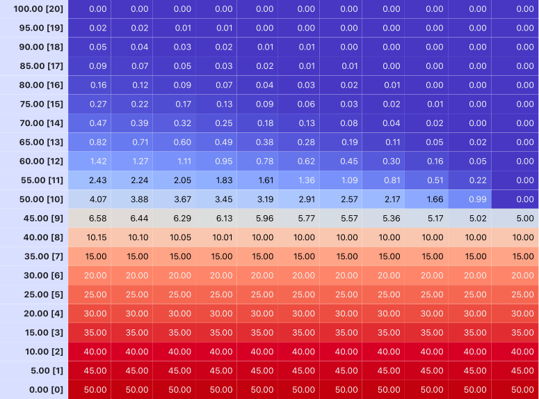

# Option_Pricing_Numerical_Methods

This repository contains implementations of numerical methods for option pricing, based on **Hull, J. C. (2003).** *Options, Futures, and Other Derivatives* (2nd ed.). Prentice-Hall, specifically Chapter 14: Numerical Procedures.

<p float="left">
  
   
</p>

## Table of Contents
- [Overview](#overview)
- [Implemented Classes and Methods](#implemented-classes-and-methods)
- [Dependencies](#dependencies)
- [Usage](#usage)
- [References](#references)

## Overview

The purpose of this repository is to provide a practical implementation of various numerical methods for pricing derivatives as described in Chapter 14: Numerical Procedures of John Hull's textbook *Options, Futures, and Other Derivatives*. These methods can be used to value derivative securities where analytical solutions may not be available or practical.
In addition to this, hedge parameters such as delta, gamma, theta, vega and rho can be estimated using prices obtained numerically (by recomputing the desired option price with a small change in relevant variable) or with procedures specific to the used numerical method.

### Key Topics:
- Building Desired Option
- Binomial Tree
- Implicit Finite Difference
- Explicit Finite Difference
- Monte Carlo Simulation
- Hedge Parameter Estimation (To be implemented)

## Implemented Classes and Methods

The following have been implemented:

1. **Option Class**
   - A custom class with assignable payoff function and american style pricing attribute
   so that a wide variety of derivatives can be considered. Call and Put subclasses are already defined.

2. **Binomial Option Pricing Model**
   - A tree-based method to model the evolution of the underlying asset's price and calculate the price of the given option.

3. **Implicit Finite Difference Method**
   - A numerical solution to the Black and Scholes differential equation to price
   the given option.

4. **Explicit Finite Difference Method**
   - A numerical solution to the Black and Scholes differential equation to price
   the given option with simplified calculation (no inversion of matrices) based on
   assumption that first and second order partial derivatives of option price with respect to underlying asset price are very similar between adjacent time steps.

5. **Monte Carlo Simulation**
   - A stochastic method used to simulate the underlying asset's price paths and calculate the price of the given option by taking the average of the final payoffs.

## Dependencies

To run the code in this repository, you need the following dependencies:

- Python 3.x
- NumPy
- Pandas
- Matplotlib
- Jupyter (optional, for running notebooks)

## Usage

1. **Clone the Repository:**

   ```bash
   git clone https://github.com/lr1021/Option_Pricing_Numerical_Methods.git
   cd Option_Pricing_Numerical_Methods
   ```

2. **Run the Notebooks or Scripts:**
   - You can explore the Jupyter notebooks provided in the `notebooks/` directory, which contain explanations, code, and examples. If there are rendering problems within the Jupyter notebooks, have a look at the homonymous .pdf files in the same directory
   - You can view the numerical method implementations in the Python scripts in the `methods/` directory, which contain class definitions and methods (with some helper functions mostly for visualisation)

3. **Customise Option to be priced and Method Parameters:**
   - Each method allows for customization of priced option and parameters like the number of time steps, volatility, risk-free rate, and more. Modify these parameters as needed within the scripts or notebooks.

## References

- **John C. Hull. (2003).** *Options, Futures, and Other Derivatives* (2nd ed.). Prentice-Hall.

This textbook is a widely recognized reference for derivatives pricing and includes detailed explanations of the numerical methods implemented in this repository.

---

### Example Notebooks and Code:

Feel free to explore the provided notebooks that demonstrate how each method can be applied to price European and American options, as well as more complex derivatives.

---

### License
This project is licensed under the MIT License - see the [LICENSE](./LICENSE) file for details.

